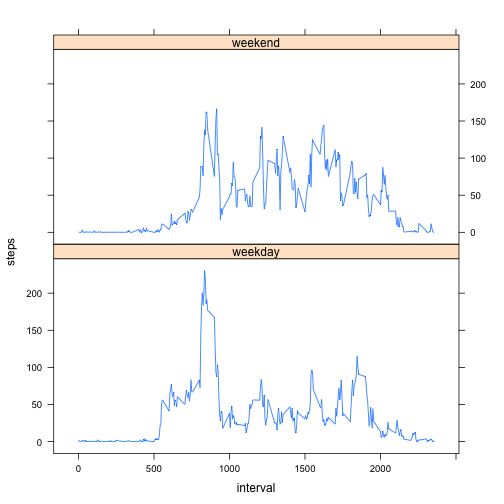

## Loading and preprocessing the data


```r
unzip('activity.zip')
act <- read.csv('activity.csv', header=T)
act$date <- as.Date(act$date, '%Y-%m-%d') # convert to date from string
```

## What is mean total number of steps taken per day?

Following code plots the histogram of the total steps taken per day and also
calculates the mean and median of the total steps:

```r
steps_p_day <- aggregate(steps ~ date, act, sum)
hist(steps_p_day$steps, xlab = 'Total steps', main = paste('Histogram of total steps taken per day'))
```

 

```r
mean_steps <- as.integer(mean(steps_p_day$steps))
median_steps <- as.integer(median(steps_p_day$steps))
```

Mean of the total steps taken is ``10766`` and
Median of the total steps taken is ``10765``.


## What is the average daily activity pattern?

Following code creates the plot showing the daily activity pattern of the
person, by taking mean of steps of all the 5-min interval for all days
(i.e. mean of steps of all the intervals of having same value and belonging to different day):


```r
act_pattern <- aggregate(steps ~ interval, act, mean, na.action = na.omit) # calculate mean steps over intervals for all days
max_interval <- act_pattern[act_pattern$steps == max(act_pattern$steps),] # find the interval having maximum steps

plot(act_pattern, type = 'l')
points(max_interval$interval, max_interval$steps, col = 'red', lwd = 3, pch = 1) # show the interval having maximum steps using red dot.
```

 

On average across all the days in the dataset, interval ``835`` contains the maximum number of steps.

## Imputing missing values


```r
tna <- sum(is.na(act$steps))
```
There are total ``2304``  missing values in dataset.

Following codes imputes that data by filling the missing value of steps
associated with the given interval with mean of the same interval for all
days for which data is present:


```r
f_act <- act
for(i in act_pattern$interval) {
  f_act[is.na(f_act$steps) & f_act$interval == i,]$steps =  act_pattern[ act_pattern$interval == i,]$steps
}
```

Following code plots the histogram of the imputed dataset

```r
f_steps_p_day <- aggregate(steps ~ date, f_act, sum)
hist(f_steps_p_day$steps, xlab = 'Total steps', main = paste('Histogram of total steps taken per day (Imputed data)'))
```

 

```r
f_mean_steps <- as.integer(mean(f_steps_p_day$steps))
f_median_steps <- as.integer(median(f_steps_p_day$steps))
```

Mean of the total steps taken is ``10766`` and
Median of the total steps taken is ``10766`` after imputing data.

After imputing, mean remained same (as expected since we replaced missing
values with mean) but median increased in small quantity.

From the histogram its clear that the total frequency of the steps between
10000 and 15000 has increased from ~25 to ~35 since we filled the missing
data with mean steps per interval (mean of the total steps per day lies
between 10000 and 15000).


## Are there differences in activity patterns between weekdays and weekends?

Following R code plots the activity pattern of the person on weekdays and weekends.

```r
library(lattice)

day <- weekdays(f_act$date, ab = T)
f_act$day <- sapply(day, function (x) {
  if(x == 'Sat' | x == 'Sun')
    'weekend'
  else
    'weekday'
  })

day_act_pattern <- aggregate(steps ~ interval + day, f_act, mean, na.action = na.omit) # calculate mean steps over intervals and day-type (i.e weekend and weekday) for all days

xyplot(steps ~ interval | day , data = day_act_pattern, layout = c(1, 2), type = 'l')
```

 

From the data it looks like the person is active throughout the day on
weekends (except at night), but on weedays s/he active only in the morning
and has compartively sedentary working hours.
